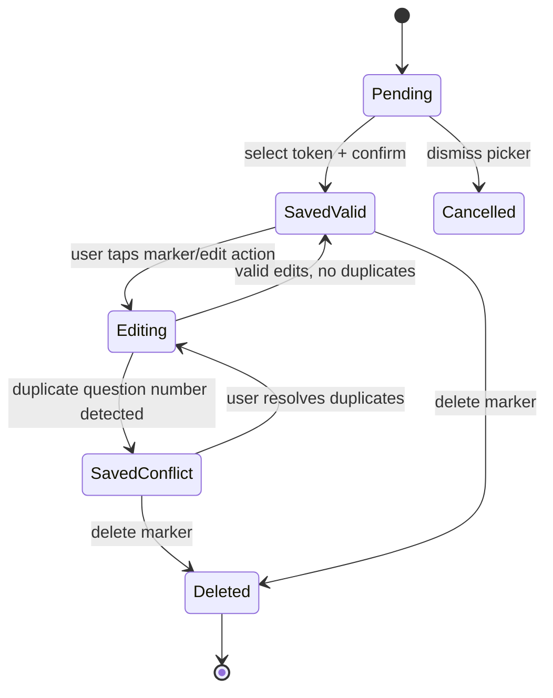
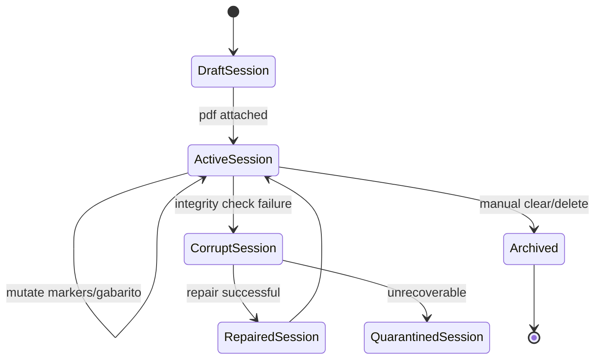

# Mobile Practice V1 - Domain Data Model (Ralph Spec)

## 1) Document Metadata

| Field | Value |
|---|---|
| Spec ID | MP-V1-DOMAIN-DATA |
| Version | 1.0.0 |
| Depends On | `00-system-contract-ralph-spec.md` |
| Audience | Implementation agents, QA agents |
| Priority | P0 |

---

## 2) Domain Glossary

| Term | Definition |
|---|---|
| Session | A persistent workspace bound to exactly one PDF |
| Marker | User annotation anchored to a PDF page coordinate with answer token + question number |
| Gabarito | Official answer key mapping question number -> token |
| Conflict | Condition where multiple user markers share the same question number |
| Not gradable | Question where gabarito has no entry |
| Pending Marker | In-progress marker before final confirmation |

---

## 3) Canonical Types (TypeScript Contract)

```ts
export type AnswerToken = 'A' | 'B' | 'C' | 'D' | 'E' | '-'

export type MarkerStatus = 'valid' | 'conflict' | 'orphaned'
export type RowStatus = 'correct' | 'wrong' | 'blank' | 'conflict' | 'not_gradable'

export interface Session {
  id: string
  title: string
  createdAt: number
  updatedAt: number
  pdfFileName: string
  pdfMimeType: string
  pdfByteLength: number
  pdfSha256: string
  pageCount: number | null
  lastInsertedQuestionNumber: number | null
  ui: SessionUiState
}

export interface SessionUiState {
  activeTab: 'solve' | 'review' | 'session'
  handedness: 'right' | 'left'
  zoomMode: 'free'
  lastViewedPage: number
}

export interface Marker {
  id: string
  sessionId: string
  pageNumber: number
  xPct: number
  yPct: number
  questionNumber: number
  answerToken: AnswerToken | null
  status: MarkerStatus
  createdAt: number
  updatedAt: number
}

export interface GabaritoEntry {
  id: string
  sessionId: string
  questionNumber: number
  answerToken: AnswerToken
  source: 'import' | 'manual'
  createdAt: number
  updatedAt: number
}

export interface ImportReport {
  totalTokens: number
  importedCount: number
  skippedCount: number
  warnings: ImportWarning[]
}

export interface ImportWarning {
  index: number
  rawValue: string
  reason:
    | 'INVALID_TOKEN'
    | 'INVALID_QUESTION_NUMBER'
    | 'MALFORMED_PAIR'
    | 'DUPLICATE_GABARITO_ENTRY'
}

export interface GradingSnapshot {
  sessionId: string
  computedAt: number
  gradableCount: number
  correctCount: number
  wrongCount: number
  blankCount: number
  conflictExcludedCount: number
  notGradableCount: number
  accuracy: number | null
  rows: ReviewRow[]
}

export interface ReviewRow {
  questionNumber: number
  userMarkers: Marker[]
  effectiveUserToken: AnswerToken | null
  gabaritoToken: AnswerToken | null
  status: RowStatus
}
```

---

## 4) Invariants (Must Hold at All Times)

| ID | Invariant | Enforcement |
|---|---|---|
| INV-01 | `Session` has exactly one PDF blob | Session creation and import guards |
| INV-02 | `Marker.pageNumber` >= 1 | Input validation |
| INV-03 | `xPct` and `yPct` in `[0,1]` | Coordinate normalization check |
| INV-04 | `questionNumber` >= 1 | Marker edit validation |
| INV-05 | `GabaritoEntry.questionNumber` >= 1 | Import parser validation |
| INV-06 | `answerToken` belongs to token set | Shared token parser/validator |
| INV-07 | Conflict status derived, not manually trusted | Recompute on marker mutations |

---

## 5) IndexedDB Storage Contract

## 5.1 Database Definition

| Field | Value |
|---|---|
| Database Name | `mobile-practice-db` |
| Version | `1` |

### 5.2 Object Stores

| Store | Key Path | Indexes |
|---|---|---|
| `sessions` | `id` | `updatedAt`, `createdAt` |
| `pdfBlobs` | `sessionId` | none |
| `markers` | `id` | `sessionId`, `[sessionId+questionNumber]`, `[sessionId+pageNumber]`, `updatedAt` |
| `gabaritoEntries` | `id` | `sessionId`, `[sessionId+questionNumber]`, `updatedAt` |
| `meta` | `key` | none |

### 5.3 Blob Storage Strategy

- Store PDF binary in `pdfBlobs` keyed by `sessionId`.
- Metadata in `sessions` includes hash and byte size for integrity checks.
- Do not base64 encode PDF; store as `Blob` directly to avoid memory inflation.

---

## 6) State Machines

## 6.1 Marker Lifecycle State Machine



## 6.2 Session Lifecycle State Machine



---

## 7) Core Algorithms (Deterministic)

## 7.1 Coordinate Normalization

### Inputs
- `tapX`, `tapY` relative to rendered page element.
- `renderWidth`, `renderHeight`.

### Formula
- `xPct = clamp(tapX / renderWidth, 0, 1)`
- `yPct = clamp(tapY / renderHeight, 0, 1)`

### Reverse Mapping
- `pixelX = xPct * renderWidth`
- `pixelY = yPct * renderHeight`

### Precision
- Persist with at least 4 decimal places.
- Avoid integer rounding in storage layer.

## 7.2 Conflict Detection

```ts
export function deriveMarkerStatuses(markers: Marker[]): Marker[] {
  const byQuestion = new Map<number, Marker[]>()
  for (const marker of markers) {
    const arr = byQuestion.get(marker.questionNumber) ?? []
    arr.push(marker)
    byQuestion.set(marker.questionNumber, arr)
  }
  return markers.map((marker) => {
    const siblings = byQuestion.get(marker.questionNumber) ?? []
    const isConflict = siblings.length > 1
    return { ...marker, status: isConflict ? 'conflict' : 'valid' }
  })
}
```

## 7.3 Effective User Token Resolution per Question

Policy for V1:
- If exactly one marker exists for question -> use its token.
- If more than one marker exists -> conflict, no effective token.
- If none -> null.

```ts
export function resolveEffectiveUserToken(markersForQuestion: Marker[]): AnswerToken | null {
  if (markersForQuestion.length !== 1) return null
  return markersForQuestion[0].answerToken
}
```

---

## 8) Grading Engine Contract

## 8.1 Inputs

- All markers for session (with derived conflict status).
- All gabarito entries for session.

## 8.2 Evaluation Order

1. Build union set of question numbers from markers and gabarito.
2. For each question:
   - inspect marker multiplicity,
   - inspect gabarito existence,
   - classify row status.
3. Aggregate counters.

## 8.3 Classification Table

| Condition | Status | Counter Impact |
|---|---|---|
| marker count > 1 | `conflict` | `conflictExcludedCount +1` |
| marker count <= 1 and gabarito missing | `not_gradable` | `notGradableCount +1` |
| marker single, gabarito exists, token equals | `correct` | `gradableCount +1`, `correctCount +1` |
| marker single, gabarito exists, token mismatch | `wrong` | `gradableCount +1`, `wrongCount +1` |
| marker none, gabarito exists | `blank` | `gradableCount +1`, `wrongCount +1`, `blankCount +1` |
| marker token `-`, gabarito exists non-`-` | `blank` | `gradableCount +1`, `wrongCount +1`, `blankCount +1` |

---

## 9) Review Row Construction Contract

Algorithm constraints:
- Sorted ascending by `questionNumber`.
- Row retains full `userMarkers[]` list for conflict inspection UI.
- `effectiveUserToken` null for conflict and no-marker cases.

```ts
export function buildReviewRows(markers: Marker[], gabarito: GabaritoEntry[]): ReviewRow[] {
  // Pseudocode-level contract:
  // 1. Group markers by question number.
  // 2. Index gabarito by question number.
  // 3. Union all keys.
  // 4. Classify each row deterministically.
  // 5. Sort by numeric question ascending.
  return []
}
```

---

## 10) Consistency Recompute Triggers

Recompute conflict statuses and grading snapshot when:
1. Marker created.
2. Marker edited (token or question number or position).
3. Marker deleted.
4. Gabarito imported.
5. Gabarito edited.
6. Gabarito entry deleted.
7. Session loaded from storage.

If recompute fails:
- keep previous valid snapshot,
- log structured error object,
- show non-blocking warning banner.

---

## 11) Error and Recovery Model

| Error Code | Description | Recovery |
|---|---|---|
| `E_DB_OPEN` | IndexedDB open/upgrade failed | Retry with exponential backoff, then hard error UI |
| `E_DB_WRITE` | Transaction failed | Roll back optimistic UI and retry once |
| `E_PDF_BLOB_MISSING` | Session exists without PDF blob | Mark session corrupt and request reattach |
| `E_SCHEMA_INVALID` | Stored record invalid | Attempt normalize/repair; quarantine if impossible |
| `E_GABARITO_PARSE` | Import parse warnings/errors | Keep valid subset and show report |

---

## 12) Migration Readiness (Future-Proofing)

Even in V1, include migration hooks:

| Component | Requirement |
|---|---|
| DB versioning | Use explicit `onupgradeneeded` branches |
| Record format | Include optional `schemaVersion` fields |
| Session config | Keep `ui` object extensible |
| Answer tokens | Centralized token parser to allow later expansion |

---

## 13) Agent Implementation Checklist

| Step | Deliverable | Gate |
|---|---|---|
| D1 | Type contracts in shared module | All invariants represented |
| D2 | IndexedDB adapter with stores/indexes | Basic CRUD tests pass |
| D3 | Conflict derivation utility | Duplicate scenarios tested |
| D4 | Grading engine | Snapshot outputs deterministic |
| D5 | Row builder for review UI | Sorting and statuses validated |
| D6 | Error code mapping | UI displays human-readable messages |

---

## 14) QA Seed Cases

| Case | Input | Expected |
|---|---|---|
| Q-01 | No markers, no gabarito | zeroed counters, empty rows |
| Q-02 | Marker Q1=A, gabarito Q1=A | correct=1 |
| Q-03 | Marker Q1=A, gabarito Q1=B | wrong=1 |
| Q-04 | Marker Q1='-', gabarito Q1=C | blank=1 wrong=1 |
| Q-05 | Markers Q1=A and Q1=C, gabarito Q1=A | conflictExcluded=1 |
| Q-06 | Marker Q5=B, no gabarito Q5 | notGradable=1 |
| Q-07 | Invalid import token `Z` among valid tokens | partial import + warning |

