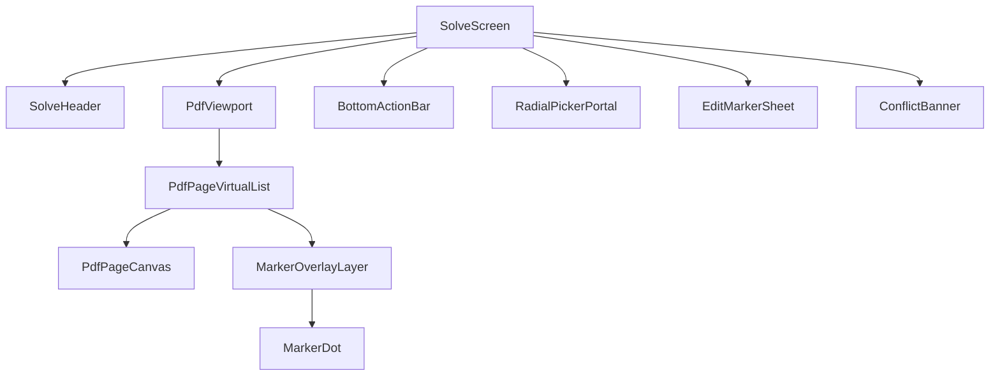

# Mobile Practice V1 - Solve Screen Interaction Spec (Ralph Spec)

## 1) Document Metadata

| Field | Value |
|---|---|
| Spec ID | MP-V1-SOLVE-UI |
| Version | 1.0.0 |
| Depends On | `00-system-contract-ralph-spec.md`, `01-domain-data-model-ralph-spec.md` |
| Primary Audience | Frontend implementation agents |
| Secondary Audience | UX QA agents |

---

## 2) Solve Screen Goals

1. Enable fast answer capture directly over PDF context.
2. Keep user spatial memory by showing markers where they tapped.
3. Preserve precision with zoom/pan without marker drift.
4. Provide immediate editing and deletion affordances.
5. Keep primary controls thumb-reachable where technically possible.

---

## 3) Screen Composition (Contract)

## 3.1 Layout Regions

| Region ID | Region | Purpose | Anchor |
|---|---|---|---|
| R1 | Top utility strip | session title, page indicator, optional warning badge | top |
| R2 | PDF viewport | render pages, detect taps, enable pan/zoom | center |
| R3 | Overlay marker layer | display markers on page coordinates | absolute over each page |
| R4 | Bottom interaction bar | mode indicators, quick actions, tab bar integration | bottom |
| R5 | Floating radial picker portal | answer token selection near interaction point | dynamic |

## 3.2 Component Tree



---

## 4) Rendering and Coordinate System

## 4.1 Coordinate Spaces

| Space | Description | Stored? |
|---|---|---|
| PDF intrinsic | Native PDF page dimensions | No |
| Rendered page pixels | Current viewport size and zoom level | No |
| Normalized page coordinates (`xPct`,`yPct`) | [0..1] relative position | Yes |

## 4.2 Contract Rules

1. Markers are stored in normalized coordinates only.
2. Marker pixel projection is computed each render using page client rect.
3. Zooming or orientation changes must never mutate stored coordinates.
4. Marker drag updates normalized coordinates at drag end.

---

## 5) Interaction Matrix

| Action ID | User Gesture | Preconditions | Result | Persisted |
|---|---|---|---|---|
| I-01 | Tap empty PDF area | Solve tab active | Create pending marker candidate | No |
| I-02 | Select radial token | Pending candidate exists | Save marker with default question number | Yes |
| I-03 | Edit question number before commit | Candidate exists | Update candidate question number | No |
| I-04 | Tap existing marker | Marker exists | Open edit sheet (answer/number/delete) | No |
| I-05 | Drag marker | Marker selected and drag enabled | Move marker position | Yes |
| I-06 | Delete marker | Edit sheet open | Remove marker and recompute grade | Yes |
| I-07 | Pinch zoom | Gesture on PDF viewport | Scale page render | No |
| I-08 | Pan | zoom > base or natural scroll | Move viewport | No |
| I-09 | Receive jump request from review | Marker target exists | Navigate to page and highlight marker | No |

---

## 6) Pending Marker Flow (Detailed)

## 6.1 Trigger
- User taps a non-marker area on a rendered page.

## 6.2 Pending Marker Object

```ts
interface PendingMarker {
  pageNumber: number
  xPct: number
  yPct: number
  suggestedQuestionNumber: number
  selectedToken: AnswerToken | null
}
```

## 6.3 Suggested Question Number Rule

`suggestedQuestionNumber = (session.lastInsertedQuestionNumber ?? 0) + 1`

## 6.4 User Override

User can edit question number inline before token confirmation.

Validation:
- integer only,
- min `1`,
- show duplicate warning if already used.

---

## 7) Radial Picker Specification

## 7.1 Token Set

`A B C D E -`

## 7.2 Geometry Contract

| Parameter | Value (recommended) | Notes |
|---|---|---|
| Outer radius | 72 px | Scaled slightly by device pixel ratio |
| Inner dead zone | 24 px | Cancel zone / no selection |
| Slice count | 6 | One per token |
| Slice angle | 60 degrees each | Equal partition |
| Min target arc length | >= 36 px | Ensure touchability |

## 7.3 Interaction Contract

1. Picker appears centered at tap point unless clipping would occur.
2. If clipping risk exists, picker repositions inward while marker anchor remains unchanged.
3. Hover/drag highlight previews selected token.
4. Selection commits on pointer release inside a valid slice.
5. Release in dead zone cancels pending marker.

## 7.4 Visual Contract

| Element | Required Style Behavior |
|---|---|
| Active slice | High contrast fill |
| Inactive slices | Low contrast fill |
| Token label | Always readable on dark mode |
| Center label | Shows question number currently targeted |

---

## 8) Marker Editing Specification

## 8.1 Edit Entry Points

| Entry Point | Action |
|---|---|
| Tap marker | Open edit sheet anchored bottom |
| Tap user answer in review | Open Solve + focus marker + edit sheet |

## 8.2 Editable Fields

| Field | Allowed Values | Validation |
|---|---|---|
| Question number | integer >= 1 | Alert before creating duplicate |
| Answer token | `A-E,-` | Strict token set |
| Position | drag on page | clamp 0..1 |

## 8.3 Duplicate Warning UX

When question edit would create duplicate:
- show pre-commit alert:
  - title: "Question number already used"
  - body: "Saving this change creates a conflict and excludes this question from grading."
  - actions: `Cancel` / `Continue`

---

## 9) Jump-to-Marker from Review

## 9.1 Input Contract

Jump request payload:

```ts
interface JumpRequest {
  sessionId: string
  markerId: string
  pageNumber: number
}
```

## 9.2 Behavior Contract

1. Switch to Solve tab.
2. Ensure target page is mounted (lazy-load allowed).
3. Scroll viewport to page.
4. Auto-center marker if possible.
5. Apply temporary highlight pulse (800-1200 ms).

## 9.3 Failure Modes

| Condition | Handling |
|---|---|
| Marker missing | Show warning toast and remain on current position |
| Page failed to render | Retry once, then show blocking modal |
| Session mismatch | Ignore request, log structured error |

---

## 10) Performance and Rendering Contract

## 10.1 Virtualization Requirements

- Do not render all PDF pages simultaneously on mobile.
- Keep at most:
  - current page,
  - one page before,
  - one page after,
  in active render window (configurable).

## 10.2 Marker Layer Optimization

1. Use per-page marker subsets (`markersByPage`) memoized by page number.
2. Avoid global rerender of all markers on single marker edit.
3. Prefer transform-based positioning over layout-thrashing style writes.

## 10.3 Budget Targets

| Metric | Target |
|---|---|
| Marker placement response | < 120 ms perceived delay |
| Edit save latency (local DB write) | < 80 ms median |
| Jump-to-marker completion | < 600 ms typical |

---

## 11) Mobile Ergonomics Contract

1. Primary tab/navigation at bottom.
2. Edit sheet opens from bottom.
3. Radial picker can appear anywhere, but:
   - if near top edge, allow re-centered picker to reduce finger stretch.
4. Minimum interactive size for controls: `44x44` CSS px.

---

## 12) Accessibility Baseline (V1 Minimum)

| Requirement | Solve Screen Rule |
|---|---|
| Screen reader label | Marker announces question + answer status |
| Touch target size | >= 44px |
| Contrast | token text and status badges readable in dark mode |
| Motion safety | allow reduced highlight animation if reduced-motion enabled |

---

## 13) Event Contract (Optional but Recommended)

Local event log (no server in V1) for diagnostics:

| Event | Payload |
|---|---|
| `marker_create_start` | sessionId, pageNumber |
| `marker_create_commit` | markerId, questionNumber, token |
| `marker_edit_commit` | markerId, changes |
| `marker_delete` | markerId |
| `jump_to_marker` | markerId, source='review' |
| `radial_picker_cancel` | reason |

Purpose:
- QA replay,
- bug diagnosis,
- future analytics migration.

---

## 14) Solve Screen Acceptance Tests

| Test ID | Scenario | Expected |
|---|---|---|
| S-UI-01 | Tap PDF and select token | marker persisted with next question number |
| S-UI-02 | Tap marker and edit question to duplicate | warning shown, conflict status if confirmed |
| S-UI-03 | Drag marker while zoomed | marker remains correctly anchored after zoom reset |
| S-UI-04 | Jump from review question number | correct page and marker highlighted |
| S-UI-05 | Delete marker | row and grading recompute immediately |
| S-UI-06 | Cancel radial selection | no marker persisted |
| S-UI-07 | Orientation change | marker positions remain stable |

---

## 15) Agent Build Order (Solve Screen)

1. Implement static layout shells and tab integration.
2. Add PDF renderer with page virtualization.
3. Add marker overlay rendering from persisted data.
4. Implement pending marker creation and radial picker.
5. Commit marker creation with DB persistence.
6. Implement edit sheet (answer, question number, delete).
7. Implement drag-to-reposition.
8. Implement jump-to-marker with page mount synchronization.
9. Add conflict/warning UX.
10. Run solve screen acceptance test matrix.

