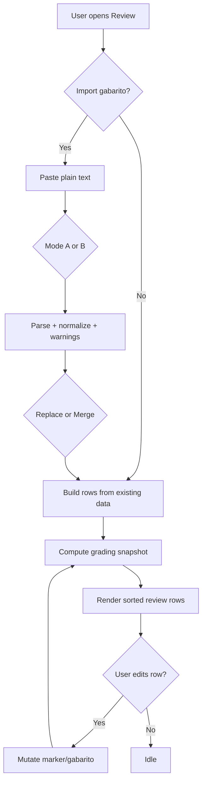

# Mobile Practice V1 - Import, Review, and Grading Spec (Ralph Spec)

## 1) Document Metadata

| Field | Value |
|---|---|
| Spec ID | MP-V1-IMPORT-REVIEW-GRADE |
| Version | 1.0.0 |
| Depends On | `00-system-contract-ralph-spec.md`, `01-domain-data-model-ralph-spec.md` |
| Audience | Parser agents, UI agents, QA agents |

---

## 2) Objectives

1. Support two plain-text gabarito formats with deterministic parsing.
2. Allow partial import with transparent warnings.
3. Produce deterministic grading snapshot.
4. Expose a review interface that supports both diagnosis and correction.

---

## 3) Accepted Input Formats

## 3.1 Format A - Numbered Pairs

Examples:
- `1A,2B,3C`
- `1:A; 2:B; 3:C` (if delimiters allowed by normalizer)

Canonical interpretation:
- each entry defines explicit question number and answer token.

## 3.2 Format B - Sequential Tokens

Examples:
- `A,B,D,A,C`
- `A B D A C` (if whitespace delimiter support enabled)

Canonical interpretation:
- token order determines question number sequence,
- start question number provided by user.

---

## 4) Token and Grammar Contract

## 4.1 Allowed Tokens

`A`, `B`, `C`, `D`, `E`, `-`

Case policy:
- Case-insensitive input accepted.
- Stored canonical uppercase.

## 4.2 Formal Grammar (Normalized)

### Format A (Normalized)

```ebnf
formatA      = pair, { separator, pair } ;
pair         = questionNumber, token ;
questionNumber = nonZeroDigit, { digit } ;
token        = "A" | "B" | "C" | "D" | "E" | "-" ;
separator    = "," ;
digit        = "0" | nonZeroDigit ;
nonZeroDigit = "1" | "2" | "3" | "4" | "5" | "6" | "7" | "8" | "9" ;
```

### Format B (Normalized)

```ebnf
formatB      = token, { separator, token } ;
token        = "A" | "B" | "C" | "D" | "E" | "-" ;
separator    = "," ;
```

---

## 5) Input Normalization Pipeline

| Step | Operation | Notes |
|---|---|---|
| N-01 | Trim outer whitespace | mandatory |
| N-02 | Uppercase text | mandatory |
| N-03 | Replace semicolon with comma | optional convenience |
| N-04 | Collapse repeated separators | convert `,,` to `,` with warning |
| N-05 | Strip internal spaces around separators | keep parse deterministic |

Important:
- Normalization must not silently invent question numbers.
- Any destructive normalization emits warning metadata.

---

## 6) Parser Behavior

## 6.1 Mode Selection

| Condition | Selected Mode |
|---|---|
| Contains digit+token pairs (`1A`) pattern majority | Format A |
| Contains only token list | Format B |
| Ambiguous | Prompt user to choose mode |

## 6.2 Format A Parser Steps

1. Split by comma.
2. Parse each segment as `questionNumber + token`.
3. Validate:
   - question number integer >= 1,
   - token in set.
4. Build provisional entries.
5. Resolve duplicate question numbers according to import strategy.

## 6.3 Format B Parser Steps

1. Require `startQuestionNumber` from user.
2. Split by comma.
3. Validate token set.
4. Assign question numbers incrementally:
   - first token -> start question,
   - second token -> start + 1,
   - etc.

---

## 7) Import Strategy Rules (Existing Gabarito Present)

User selection required:
- `Replace`
- `Merge`

### Replace
- delete all current gabarito entries for session,
- insert parsed valid entries.

### Merge
- upsert by `questionNumber`,
- imported value overwrites existing same question number,
- non-overlapping existing entries preserved.

---

## 8) Partial Import with Warnings

## 8.1 Warning Types

| Code | Meaning |
|---|---|
| `INVALID_TOKEN` | token not in allowed set |
| `INVALID_QUESTION_NUMBER` | non-positive or non-integer number |
| `MALFORMED_PAIR` | cannot split question/token in Format A |
| `DUPLICATE_GABARITO_ENTRY` | same question appears multiple times in import payload |

## 8.2 UI Contract for Warning Report

After import:
- always show summary:
  - imported count,
  - skipped count.
- if skipped > 0:
  - expandable warning list with index, raw segment, reason.

---

## 9) Review Screen Contract

## 9.1 Layout Regions

| Region | Contents |
|---|---|
| Header strip | Score summary counters |
| Import status strip | gabarito source and mismatch indicators |
| Question list | sorted ascending rows with status badges |
| Row actions | jump/edit entry points |

## 9.2 Row Schema

| Field | Description |
|---|---|
| Question number | numeric key, tappable for jump |
| User answer | token or placeholder |
| Gabarito answer | token or placeholder |
| Status badge | correct/wrong/blank/conflict/not gradable |
| Action affordance | edit user answer and gabarito answer |

## 9.3 Tap Behavior Matrix

| Tap Target | Result |
|---|---|
| Question number | jump to marker in Solve |
| User answer cell | open marker editor |
| Gabarito answer cell | open gabarito edit dialog |
| Status badge | optional tooltip/legend |

---

## 10) Grading Rules (Authoritative)

## 10.1 Comparison Set

Question set = union of:
- all marker question numbers,
- all gabarito question numbers.

## 10.2 Row Status Priority

Priority order applied top-down:
1. Conflict (`markerCount > 1`) -> `conflict`
2. Gabarito missing -> `not_gradable`
3. Marker missing or marker token `-` with non-blank gabarito -> `blank`
4. Marker token equals gabarito token -> `correct`
5. Otherwise -> `wrong`

## 10.3 Counter Derivation

| Counter | Rule |
|---|---|
| `conflictExcludedCount` | number of rows status `conflict` |
| `notGradableCount` | number of rows status `not_gradable` |
| `gradableCount` | rows in `{correct, wrong, blank}` |
| `correctCount` | rows status `correct` |
| `wrongCount` | rows status `wrong` + rows status `blank` |
| `blankCount` | rows status `blank` |
| `accuracy` | `correctCount / gradableCount` or `null` if gradableCount=0 |

---

## 11) Mismatch Conditions and Display Rules

You selected mismatch policy `11D`:
- missing user answers compared against existing gabarito as blank/wrong,
- missing gabarito answers shown as not gradable.

UI requirements:
1. Show mismatch chips in header:
   - `Missing user answers: X`
   - `Missing gabarito answers: Y`
2. These counts must update live after edits/imports.

---

## 12) Mermaid Flow - Import to Grade



---

## 13) Edge Case Catalog

| Case ID | Input State | Expected Behavior |
|---|---|---|
| EC-01 | Import text empty | block submit with validation |
| EC-02 | Format B without start number | block submit and request value |
| EC-03 | Import has duplicate question entries | keep last in payload + warning |
| EC-04 | Question numbers huge (`999999`) | accept if integer >=1 |
| EC-05 | User answer exists, gabarito missing | not gradable |
| EC-06 | Gabarito exists, user answer missing | blank/wrong |
| EC-07 | Marker conflict and gabarito exists | conflict overrides any right/wrong |
| EC-08 | Gabarito token is `-` and user token `-` | correct |
| EC-09 | Gabarito token `-`, user token `A` | wrong |
| EC-10 | All rows conflict | gradableCount=0, accuracy=null |

---

## 14) Editing Rules from Review

## 14.1 Edit User Answer

- If row has one marker: open edit sheet for that marker.
- If row has zero markers: open create-marker helper prompt.
- If row has conflicts: open conflict resolver modal listing all markers for question.

## 14.2 Edit Gabarito Answer

- Open inline modal with:
  - current token,
  - token selector,
  - optional delete entry action.
- Save triggers grading recompute.

---

## 15) Acceptance Test Matrix (Import/Review/Grading)

| Test ID | Scenario | Expected |
|---|---|---|
| IRG-01 | Import valid Format A | all entries persisted correctly |
| IRG-02 | Import valid Format B with start=5 | first entry maps to Q5 |
| IRG-03 | Import mixed valid/invalid | valid entries imported, warnings shown |
| IRG-04 | Replace import over existing key | previous entries removed |
| IRG-05 | Merge import over existing key | overlaps updated, others preserved |
| IRG-06 | Conflict rows present | excluded from score and visibly flagged |
| IRG-07 | Missing gabarito rows | not gradable status shown |
| IRG-08 | Missing user rows | blank/wrong counted |
| IRG-09 | Tap question number | jump to solve marker |
| IRG-10 | Tap user/gabarito answer cell | edit affordance opens correct editor |

---

## 16) Agent Build Sequence

1. Implement tokenizer and normalizer utilities.
2. Implement Format A and Format B parsers with warning outputs.
3. Implement replace/merge gabarito transaction logic.
4. Implement grading engine and review row constructor.
5. Build Review screen with fixed row contract.
6. Wire tap actions to jump/edit flows.
7. Validate with acceptance matrix.

