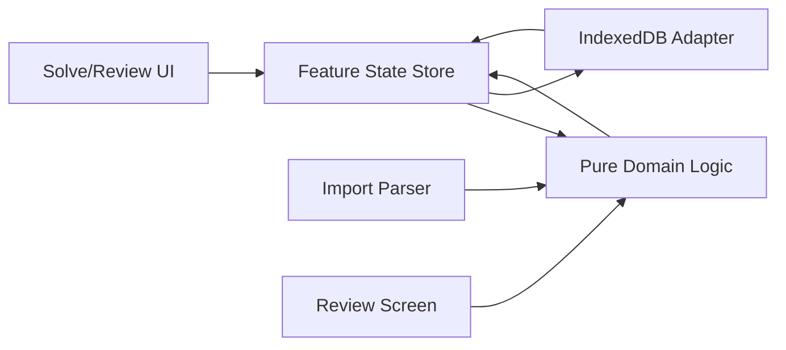

# Mobile Practice V1 - Next.js Architecture and Delivery Spec (Ralph Spec)

## 1) Document Metadata

| Field | Value |
|---|---|
| Spec ID | MP-V1-NEXTJS-ARCH |
| Version | 1.0.0 |
| Runtime Target | Next.js `16.1.6` |
| Rendering Model | Client-heavy app shell (offline-first) |
| Audience | Full-stack frontend agents, infra/test agents |

---

## 2) Architecture Drivers

1. **Offline-first** mandates local data and minimal server dependency.
2. **PDF interaction latency** mandates client-side rendering and local state.
3. **Deterministic grading** mandates pure domain logic modules.
4. **Agent maintainability** mandates strict module boundaries and typed contracts.

---

## 3) Proposed Technical Stack

| Layer | Choice | Rationale |
|---|---|---|
| Framework | Next.js App Router | modern routing and static shell |
| Language | TypeScript strict mode | data safety for grading logic |
| PDF renderer | `react-pdf` + `pdfjs-dist` | mature, acceptable mobile behavior |
| Local DB | IndexedDB via `idb` wrapper | robust async persistence |
| State | `zustand` or reducer+context | predictable UI state + persistence boundaries |
| Validation | `zod` (optional) | runtime schema guard for imports/storage |
| Testing | Vitest + Playwright | unit + mobile e2e |
| Styling | CSS modules or Tailwind | implementation preference |

Agent note:
- If avoiding extra deps, replace `zustand` and `zod` with native reducer and custom validators.

---

## 4) Directory Blueprint

```text
src/
  app/
    layout.tsx
    page.tsx
    sessions/
      page.tsx
      [sessionId]/
        page.tsx
  features/
    session/
      components/
      hooks/
      service/
    solve/
      components/
      hooks/
      service/
    review/
      components/
      hooks/
      service/
    gabarito/
      parser/
      service/
  domain/
    models/
    grading/
    conflicts/
    mappers/
  storage/
    indexeddb/
      db.ts
      stores/
  shared/
    ui/
    utils/
    constants/
    types/
  tests/
    unit/
    integration/
    e2e/
```

---

## 5) Module Responsibility Matrix

| Module | Owns | Must Not Own |
|---|---|---|
| `domain/*` | pure logic and type contracts | UI rendering, DB side effects |
| `storage/*` | persistence adapters | business scoring decisions |
| `features/solve/*` | PDF and marker UI orchestration | parser internals |
| `features/review/*` | review list and grade display | PDF render concerns |
| `features/gabarito/*` | import parsing and edit workflows | marker coordinate logic |
| `shared/*` | reusable utilities and atoms | feature-specific business flows |

---

## 6) Data Flow Diagram



---

## 7) Route Contract

| Route | Purpose | Rendering Mode |
|---|---|---|
| `/` | entry redirect or session launcher | client |
| `/sessions` | list/create sessions | client |
| `/sessions/[sessionId]` | tabbed solve/review/session screen | client |

Constraints:
- Core routes must function with no network after first load.
- Avoid server-only dependencies in core interaction path.

---

## 8) State Partitioning

## 8.1 UI State (Ephemeral)

- active tab,
- open modals/sheets,
- selected marker id,
- pending marker candidate.

## 8.2 Domain State (Persistent)

- sessions,
- markers,
- gabarito entries,
- grading snapshot (derived, can be cached).

## 8.3 Synchronization Rule

1. Apply optimistic local UI update.
2. Persist transaction to IndexedDB.
3. Recompute derived conflict + grading state.
4. Reconcile UI if persistence fails.

---

## 9) Transaction Boundaries

Use explicit DB transactions for:
1. Marker create.
2. Marker edit.
3. Marker delete.
4. Gabarito replace import.
5. Gabarito merge import.

Atomicity requirement:
- A transaction must not partially mutate marker/gabarito stores in the same operation.

---

## 10) Recommended Core APIs (Internal)

```ts
// session service
createSessionFromPdf(file: File, title?: string)
listSessions()
openSession(sessionId: string)

// marker service
createMarker(input)
updateMarker(markerId, patch)
deleteMarker(markerId)
listMarkersBySession(sessionId)

// gabarito service
parseGabaritoText(input, mode, options)
importGabarito(sessionId, entries, strategy)
editGabaritoEntry(sessionId, questionNumber, token)

// grading service
computeGradingSnapshot(markers, gabaritoEntries)
```

Implementation rule:
- services return typed result objects (`ok`, `data`, `error`) instead of thrown exceptions in normal control flow.

---

## 11) Performance Strategy

| Area | Strategy |
|---|---|
| PDF pages | virtualized page mount window |
| Marker rendering | page-scoped memoized subsets |
| Grading recompute | incremental or debounced recompute after batch edits |
| Storage writes | batched microtasks for rapid gesture edits |

---

## 12) Security and Privacy Baseline

Because V1 local-only:
- no PII required,
- no remote transmission of PDF content by default,
- avoid hidden telemetry.

If future analytics added:
- explicit opt-in banner required.

---

## 13) Testing Strategy

## 13.1 Unit Tests (P0)

| Area | Cases |
|---|---|
| Parser | valid/invalid formats, warnings |
| Conflict resolver | single/duplicate marker sets |
| Grading engine | status priority and counters |
| Coordinate mapping | normalization and reverse mapping |

## 13.2 Integration Tests (P0)

| Flow | Cases |
|---|---|
| Session open/reopen | persistence restore correctness |
| Marker CRUD | create/edit/delete consistency |
| Import + review | parser to UI pipeline |
| Jump-to-marker | review action to solve highlight |

## 13.3 E2E Mobile Tests (P1 but recommended)

| Flow | Expected |
|---|---|
| Solve 10 questions | stable performance and persistence |
| Introduce conflicts | status and score exclusion visible |
| Import malformed gabarito | partial import with warnings |
| Refresh app | full session restoration |

---

## 14) Phase Plan (Agent Execution)

## Phase 1 - Foundation
- bootstrap Next.js app shell,
- add shared type contracts,
- implement IndexedDB schema.

Gate:
- can create/read session with mock data.

## Phase 2 - Domain Engine
- parser module,
- conflict resolver,
- grading engine,
- row builder.

Gate:
- all domain unit tests green.

## Phase 3 - Solve UI
- PDF renderer,
- marker overlay,
- radial picker,
- marker edit/delete.

Gate:
- solve acceptance suite pass.

## Phase 4 - Review UI
- score summary,
- row list,
- jump/edit actions,
- gabarito import workflow.

Gate:
- import/review acceptance suite pass.

## Phase 5 - Hardening
- performance profiling,
- error handling pass,
- offline regression pass.

Gate:
- release candidate checklist complete.

---

## 15) Release Readiness Checklist

| Item | Required |
|---|---|
| All P0 unit/integration tests passing | Yes |
| Manual mobile smoke test on at least 2 viewport sizes | Yes |
| Conflict behavior validated end-to-end | Yes |
| Local data warning visible in session tab | Yes |
| No backend dependency in core flow | Yes |

---

## 16) Post-V1 Forward Hooks

Keep extension points for:
- export/import backup,
- optional cloud sync,
- richer accessibility layer,
- teacher mode.

Do not couple these future hooks into V1 core path logic.

