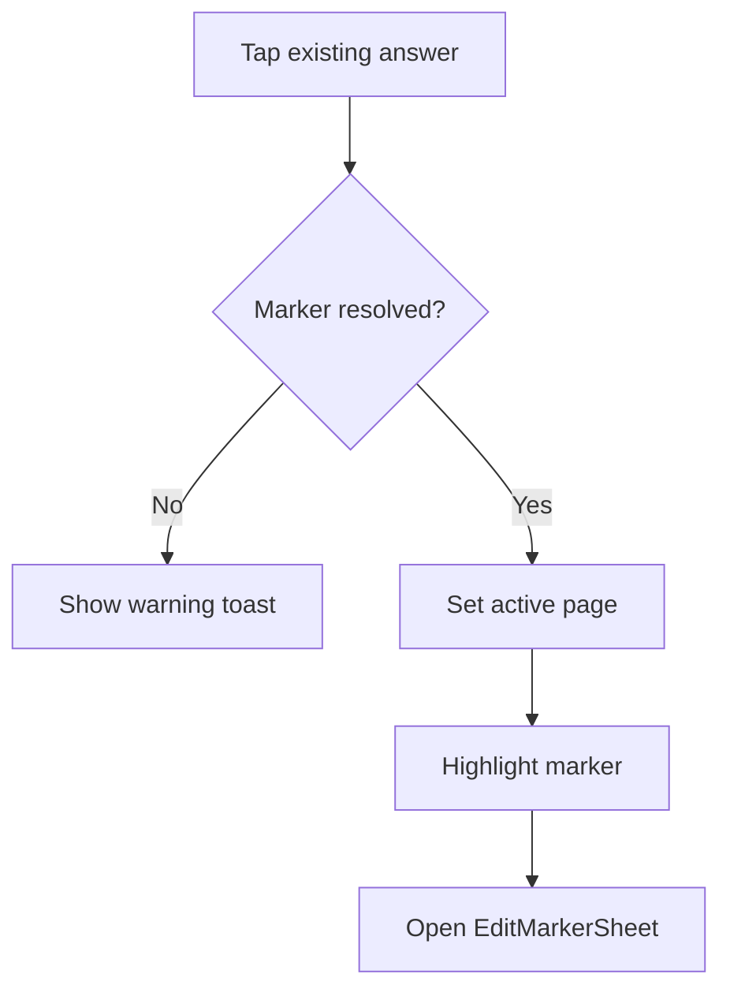

# Mobile Practice V1 - Answer Edit Entry Spec (Ralph Spec)

## 1) Document Metadata

| Field | Value |
|---|---|
| Spec ID | MP-V1-ANSWER-EDIT-ENTRY |
| Version | 1.0.0 |
| Depends On | `02-solve-screen-interaction-ralph-spec.md`, `03-import-review-grading-ralph-spec.md` |
| Audience | Solve/Review interaction agents |

---

## 2) Objective

Guarantee that tapping an existing user answer opens the intended marker edit flow reliably.

---

## 3) Contracted Entry Points

| Entry Point | Required Result |
|---|---|
| Tap marker on PDF | Open `EditMarkerSheet` for tapped marker |
| Tap user-answer cell in Review | Switch to Solve, focus marker, open `EditMarkerSheet` |
| Conflict row user-answer tap | Prompt marker selection, then open selected marker edit |

---

## 4) Behavior Rules

1. Marker identity is authoritative by `markerId`, not question index guess.
2. If target marker exists, edit sheet must open exactly once.
3. If marker does not exist, show non-blocking warning and consume request.
4. Pending-marker creation mode must be canceled before opening edit mode.

---

## 5) State Transition Contract

---

## 6) Implementation Guidance

1. Keep `openEditMarkerId` path explicit in jump payload handling.
2. Protect against race where jump request is consumed before markers are loaded.
3. Ensure pointer/tap handlers on marker dots do not accidentally trigger create-marker tap handlers.

---

## 7) Validation Matrix

| Test ID | Scenario | Expected |
|---|---|---|
| AEE-01 | Tap marker on PDF | edit sheet opens for marker id |
| AEE-02 | Tap user answer in Review row | solve tab opens edit sheet for same marker |
| AEE-03 | Tap user answer in conflict row | modal choose marker then edit opens |
| AEE-04 | Marker missing after request | warning shown, no crash |

---

## 8) Exit Criteria

1. User can consistently enter edit mode from created answers.
2. Review-to-solve edit path is deterministic.
3. Related solve and review tests pass.
