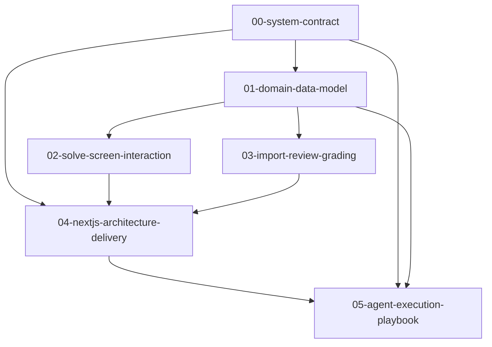

# Mobile Practice V1 - Spec Index and Reading Order (Ralph Spec)

## 1) Purpose

This file is the canonical entry point for autonomous agents.  
Read this file first, then consume specs in strict dependency order.

---

## 2) File Inventory

| Order | File | Purpose |
|---|---|---|
| 1 | `specs/00-system-contract-ralph-spec.md` | Product contract, scope, requirement IDs |
| 2 | `specs/01-domain-data-model-ralph-spec.md` | Domain types, invariants, storage, algorithms |
| 3 | `specs/02-solve-screen-interaction-ralph-spec.md` | Solve UI behavior, radial picker, marker flow |
| 4 | `specs/03-import-review-grading-ralph-spec.md` | Import grammar, review rules, grading semantics |
| 5 | `specs/04-nextjs-architecture-delivery-ralph-spec.md` | App architecture, modules, delivery phases |
| 6 | `specs/05-agent-execution-playbook-ralph-spec.md` | Work packets, gates, handoff protocol |
| 7 | `specs/99-spec-index-ralph-spec.md` | Entry point and dependency graph |

---

## 3) Dependency Graph



---

## 4) Agent Consumption Protocol

1. Parse requirement IDs from `00`.
2. Build data contracts and invariants from `01`.
3. Implement Solve flow from `02`.
4. Implement parser/review/grading from `03`.
5. Align app structure and phase execution with `04`.
6. Execute work packets and gates in `05`.
7. Report completion using template in `05`.

---

## 5) Conflict Resolution Rule

If two files appear inconsistent:
1. `00-system-contract` has highest authority for product behavior.
2. `01-domain-data-model` has highest authority for data semantics.
3. UI/architecture files must conform to 00 and 01.

If unresolved conflict remains, stop implementation and escalate.

---

## 6) Minimum Build Command Contract (Suggested)

Agents should keep a reproducible command sequence:

```bash
npm install
npm run typecheck
npm run test
npm run build
```

If project scripts differ, align command set in package-level docs before implementation continues.

